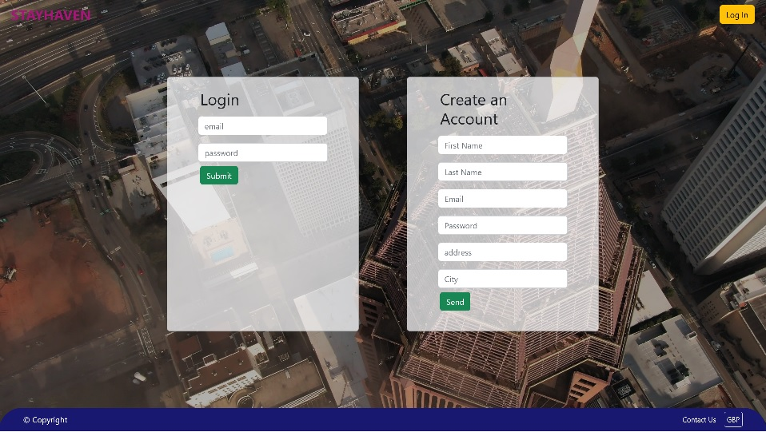

# Stayhaven

## User Story

```
- As a user, I want to be able to find quick accommodation with adjustable booking dates, select and bookmark favourite places and to view the ones I've bookmarked.

- As a user, I want to be able to list my property with appropriate details for tennants to find.
```

## Table of Contents

- [Description](#description)
- [Installation](#installation)
- [Initialisaton](#initialisation)
- [Media](#media)
- [License](#license)
- [Contributing](#contributing)
- [Questions](#questions)

## Description

Stayhaven, a Full Stack application made by Team Sequelize. Essentially a quick, responsive website hosted on Heroku in which prospective tennants and landlords can use. Packages and technologies used include:

* Node.js and Express.js
* MySql
* Sequelize ORM
* Handlebars.js
* Bootstrap

## Installation

Please follow the instructions on how to install the application:

```
- Run npm install
- Create a `.env` file and add your connection credentials
- Run database schema if this is your first time running this.
```

## Initialisation

Please follow the instructions below to run the application:

```
- node server.js
```

## Media

Deployed link: 

Below is a view of our landing page:


Below is view of our log in page:


## License

This Project is licensed under MIT 


## Contributing

Ways to contribute to the project include:


## Questions

Any questions please message any member of the team via our respective emails:

* Amina:
* Fabian:
* Idil:
* Jayad:
* Keyur:
* Natasha: